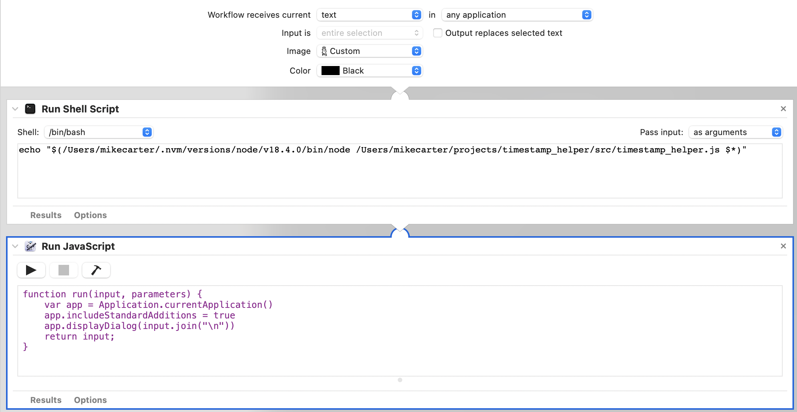

# Timestamp Helper
Do you work with since-epoch timestamped data and constantly find yourself opening a browser tab to convert it to something you can read? Give these tools a try.

### Use cases:
* Your technology stack logs in timestamps and you're constantly having to convert the timestamps for reporting in organization docs, issues, tickets, etc.
* You ran an experiment where a device collected timestamped data, and you want to quickly be able to compare event timings against your hand-written notes, or your memory of the experiment.
* Your system is doing something strange, and you want to quickly check that it's operating in the same year as everyone else!

### Setup:

For now we depend on `node` for portability. We recommend using [nvm](https://github.com/nvm-sh/nvm) to install.

The Linux setup also depends on `xsel` and `xmessage` which may have shipped with your distro, but if not, you can install them with `apt`.

[Optional] Install `jest` if you want to run the tests.

#### On Linux (tested on Ubuntu 18.04)
* Clone this repo.
* Install `node`, `xsel`, and `xmessage` if you don't already have them.
* Go to Settings > Devices > Keyboard, and add a keyboard shortcut that runs `/<absolute>/<path>/<to>/run.sh` 
* To use, highlight a timestamp and key in your keyboard shortcut!

#### On Mac (tested on Big Sur 11.6.5)
* Clone this repo.
* Install `node`.
* Open automator and create a new Quick Action automation that receives text from any application, and does not replace the selected text.
* First block is the following bash script (inputs as arguments):
```
echo "$(/<absolute path to your installation of>/node /<absolute path to this repo>/src/timestamp_helper.js $*)"
```
* Second block is the following javascript to display the output:
```
function run(input, parameters) {
	var app = Application.currentApplication()
	app.includeStandardAdditions = true
	app.displayDialog(input.join("\n"))
	return input;
}
```
* Save the script as "Timestamp Helper", or whatever name you prefer.

* Add a shortcut for this new service in `System Preferences` > `Keyboard` > `Shortcuts` > `Services`.
* Use your new keyboard shortcut to translate selected timestamps.
